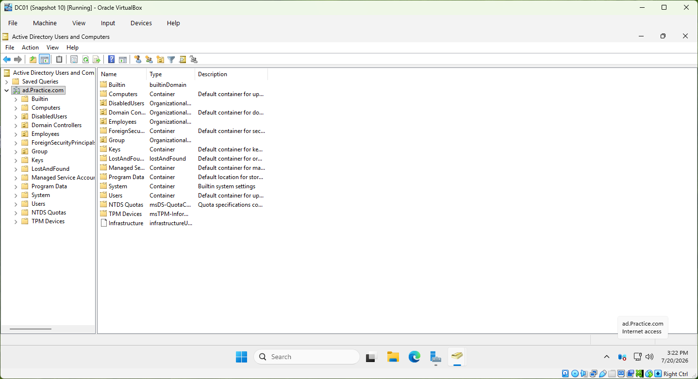
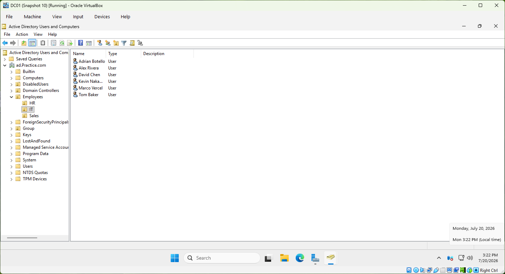
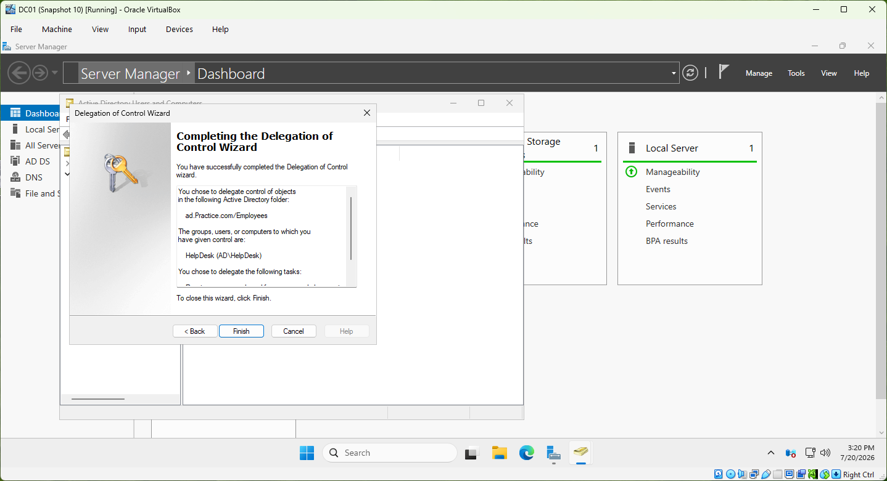
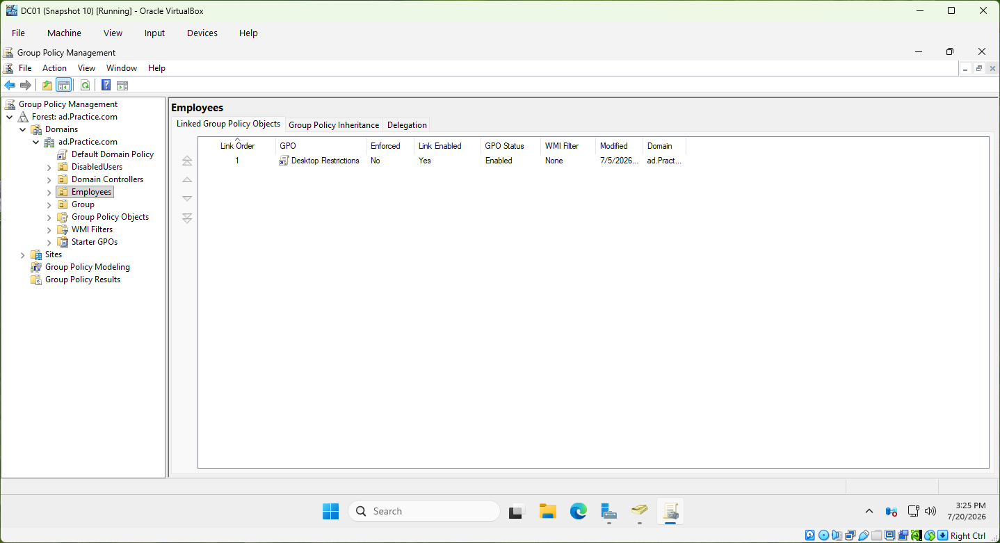
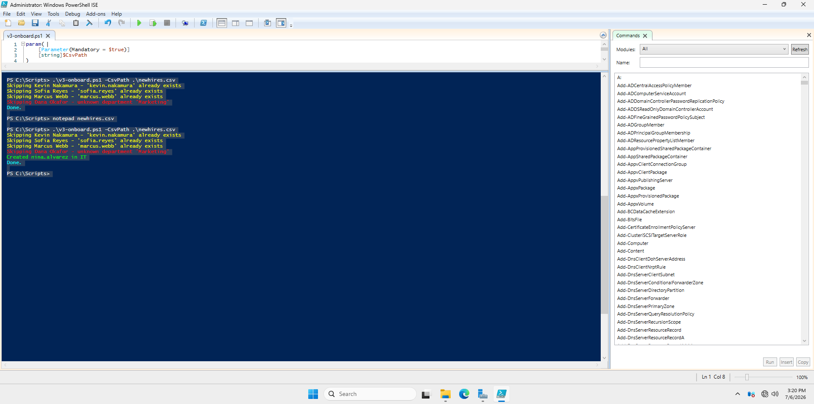
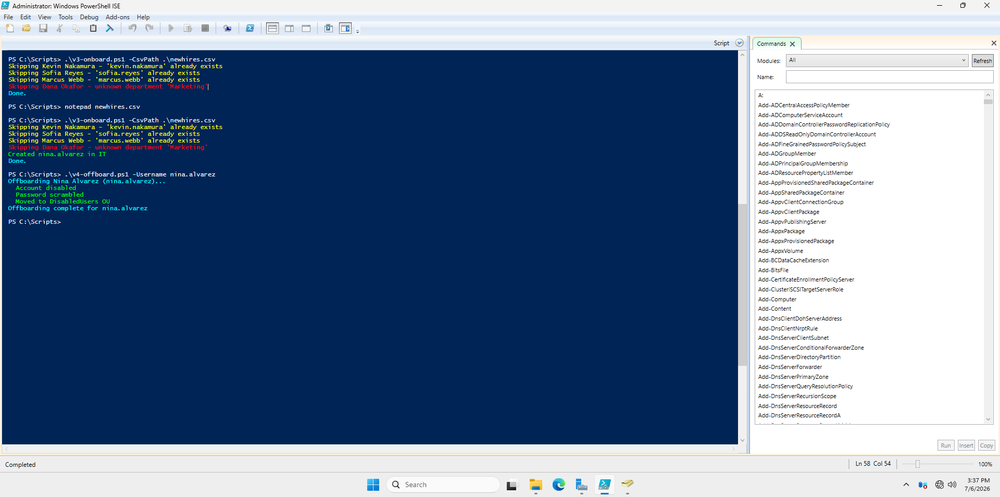

# Active Directory Home Lab — Windows Server 2025

A domain environment built from scratch in VirtualBox, with PowerShell
automation covering the full user lifecycle: onboarding (interactive → bulk
CSV → idempotent re-runs) and offboarding.

## Environment

| Component | Detail |
|---|---|
| Hypervisor | VirtualBox on Windows [11] host |
| Server | Windows Server 2025 Standard (Desktop Experience), 4GB RAM / 2 vCPU |
| Roles | AD DS, DNS |
| Domain | ad.Practice.com |
| DC | DC01 (static IP, DNS pointed at itself) |

## Directory design

    ad.Practice.com
    ├── Employees
    │   ├── IT
    │   ├── HR
    │   └── Sales
    ├── Group          (security groups)
    └── DisabledUsers  (offboarded accounts)

## What I built

- **OU structure** organized by department, with users following a
  firstname.lastname convention
- **Least-privilege delegation:** a HelpDesk security group granted only
  password-reset / force-change rights on the Employees OU via Delegate Control
- **Group Policy:** a Desktop Restrictions GPO linked to Employees that
  blocks Control Panel access
- **DNS:** split-namespace design — the AD forest lives on the ad. subdomain
  while the parent domain resolves publicly

## Scripts

Built as a deliberate progression — each version solves a limitation of the last.

| Script | What it does | What it adds |
|---|---|---|
| `v1-createuser.ps1` | Interactive single-user creation | New-ADUser, department→OU routing (if/elseif), derived email |
| `v2-bulkonboard.ps1` | Bulk onboarding from CSV | Import-Csv + foreach, per-row error handling (`continue` on bad rows) |
| `v3-onboard.ps1` | Parameterized + safe re-runs | `-CsvPath` parameter, duplicate check — re-running a grown CSV only creates new hires |
| `v4-offboard.ps1` | Offboarding | Disable account, scramble password, strip group memberships, move to DisabledUsers |

### Example (v3, run twice against the same CSV)

    Skipping Kevin Nakamura - 'kevin.nakamura' already exists
    Skipping Dana Okafor - unknown department 'Marketing'
    Created nina.alvarez in IT
    Done.

## Screenshots

## What I'd add next

- osTicket integration for a full help desk workflow (in progress)
- Windows 11 client VM joined to the domain to demonstrate GPO enforcement
- Logging to file for the onboarding scripts

## Notes

Built as a learning project with AI assistance — all code was typed, executed,
and debugged by me against my own domain. Passwords in these scripts are
lab-only placeholder values.
